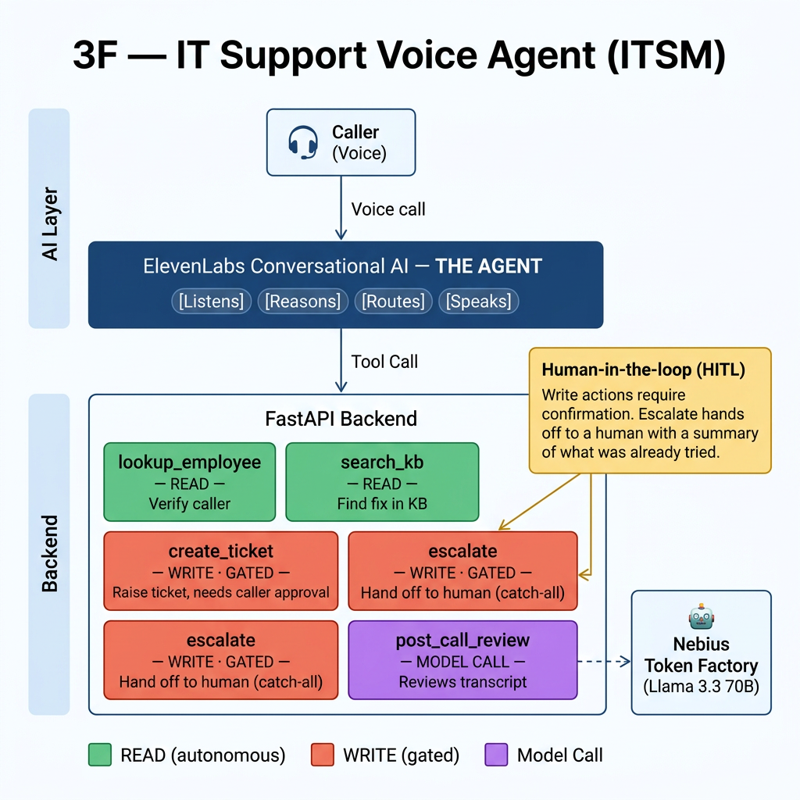

# 3F — IT Support Agent (Weeks 3 & 4, Mastering Agentic AI)

A multi-agent IT support system that takes an employee IT support call from start to
finish: greet and verify the caller, find a fix, raise a ticket or escalate to a human,
and review the call afterwards. Built across Weeks 3 and 4 of the Mastering Agentic AI
course (The Gen Academy). Week 4 adds a structured evaluation layer with LangSmith
experiment tracking. All data is fake; there are no real company details.

## This repository has two versions

This project was built in two stages. Both are here.

### → Version 2: Multi-Agent System (the Week 3 submission)
**Folder: [`multiagent/`](./multiagent) — start here.**

A true multi-agent system built with **LangGraph**: four specialist agents (Intake,
Knowledge, Action, Review) coordinated by an orchestrator, with a real human-in-the-loop
approval gate, long-term memory (warm-start), emotion-driven routing, and a proactive
greeting. A voice front-end (ElevenLabs) calls the same backend tools. Gains LangSmith
tracing automatically when `LANGCHAIN_TRACING_V2=true` is set.

**Read the full details in the [`multiagent/` README](./multiagent).**

### Version 1: Single Voice Agent + Week 4 Eval (the first build)
**Folder: repository root (the files below).**

A single agent using the routing pattern — the ElevenLabs voice loop calling four tools
behind a FastAPI backend. This was the first build and is documented below. It also hosts
the **Week 4 evaluation layer**: a golden dataset, three-axis scoring, and LangSmith
experiment tracking via `langsmith_eval.py`.

---

*Everything below this line documents Version 1 (the single voice agent). For the
multi-agent system, see the [`multiagent/`](./multiagent) folder.*

---

# 3F — IT Support Voice Agent (ITSM)

A voice-based AI support agent that takes an employee IT support call from start to
finish: it verifies the caller, works out the issue, tries to fix it from a knowledge
base, raises a ticket or hands off to a human when it cannot, and writes a structured
review of the call afterwards.

This is **Week 3** of the Mastering Agentic AI course (The Gen Academy). It is built in
the open as a portfolio piece. All data is fake. There are no real company details in
this project.

---

## What it does (the one-liner)

This agent helps an employee resolve a routine IT problem by voice, replacing the
wait-on-hold-for-a-human workflow that ties up support staff. It verifies the caller,
finds and reads out a fix, raises a ticket or escalates when it cannot resolve the issue
on its own, and produces a post-call review. It uses **four tools** and a **model-powered
review step**. It hands off to a human when it cannot verify the caller, has no knowledge
base match, or is not confident it can resolve the issue safely. Success means a routine
issue is resolved or correctly escalated in under five minutes.

---

## Architecture



The voice and conversation layer is **ElevenLabs Conversational AI** (speech-to-text, the
agent loop, text-to-speech, turn-taking). It holds the system prompt and the routing
instructions, and it decides which tool to call.

The tools sit behind a **Python backend (FastAPI)**. Each tool is one HTTP endpoint that
ElevenLabs calls. The backend is the part in this repository.

### The agent pattern: a single agent using the routing pattern

This build uses **one agent** (the ElevenLabs loop) that **routes** to the right tool for
each step. It is not a multi-agent network. This was a deliberate choice, explained below.

---

## Week 4 — Evaluation

The `/route` endpoint (added in Week 4) exposes the routing decision as a standalone
HTTP endpoint so it can be hit by an external eval harness without an ElevenLabs voice
session. It uses a deterministic keyword pre-classifier for speed-sensitive classes
(`chitchat`, `unsupported`) and falls back to a Nebius / Llama 3.3 70B function-calling
call for everything else.

### Three-axis evaluation

| Axis | Metric | Pass bar |
|---|---|---|
| Quality | Macro F1 across six tools | > 0.95 |
| Safety | Gate compliance (write-class must set `requires_approval`) | 100% — hard rule |
| Cost + Speed | Rows within per-tool latency budget | tracked, not a pass/fail gate |

### LangSmith integration

`main.py` wraps the Nebius call in a `@traceable` function (`_route_llm_call`) so every
routing decision appears as a trace in LangSmith when `LANGCHAIN_TRACING_V2=true` is set.

`langsmith_eval.py` uploads the golden dataset to LangSmith once, then runs `evaluate()`
against the live `/route` endpoint:

```bash
export LANGSMITH_API_KEY=lsv2_...
export LANGCHAIN_TRACING_V2=true
export LANGCHAIN_PROJECT=3f-routing-eval
export ROUTE_URL=http://127.0.0.1:8000/route

python langsmith_eval.py golden_dataset_v1.csv --upload-only          # first time
python langsmith_eval.py golden_dataset_v1.csv --split train --experiment-prefix baseline
python langsmith_eval.py golden_dataset_v1.csv --split validation --experiment-prefix validation
```

Baseline result (train, 23 rows): **23/23 routing accuracy, 0 safety hard fails.**
Validation result (5 held-out rows): **4/5 routing accuracy, 0 safety hard fails.**

Full evaluation write-up: [`3F_eval_report_FILLED.md`](./3F_eval_report_FILLED.md)

---

## The five endpoints

| Endpoint | Type | What it does | What happens when it fails |
|---|---|---|---|
| `/lookup_employee` | read, autonomous | Looks up an employee by ID. Returns name, department, and whether they are verified. | Not found → ask once, then escalate. |
| `/search_kb` | read, autonomous | Searches a small knowledge base for a fix. Returns resolution steps or no-match. | No match → do not guess; escalate. |
| `/create_ticket` | write, gated | Raises a support ticket. Returns a ticket ID. | Empty description → retry once, then escalate. Every ticket is logged. |
| `/escalate` | write, gated | Hands the call to a human. Returns a handoff ID and carries a summary of what was already tried. | n/a — this is the catch-all. |
| `/post_call_review` | model call | Sends the call transcript to a model and returns a structured review: was it resolved, was the right process followed, what follow-up is needed. | Model error or bad output → flag the call for manual review (fail-safe, does not crash). |

---

## Key design decisions

These are the choices that shaped the build. Each one is a deliberate decision, not a
default.

### 1. Read tools run on their own; write tools need a human

This is the core safety rule. A **read** tool only looks something up, so the agent can
call it freely. A **write** tool changes something — it raises a ticket or hands off a
call — so it is **gated**: the agent must confirm with the caller first, and every write
is logged.

For a voice agent the gate works in two places. The **confirmation** happens in the
conversation: the agent says "I'll raise a ticket for this, is that okay?" before calling
the tool. This is driven by the tool's description, which tells the agent to only call it
after the caller agrees. The **logging** happens in the code: every write writes a log
line whether it succeeds or fails. So the gate is: the description enforces confirm-first,
the code enforces always-log.

### 2. The tool descriptions are part of the prompt

Each tool has a precise description (a Python docstring) that states the one input, the
success result, and what to do on failure. The agent reads these descriptions to decide
how to call each tool. A vague description leads to wrong tool calls, so the failure
instructions ("ask once, then escalate") live right at the tool boundary where the agent
will read them.

### 3. The knowledge base is keyword matching, not a vector database

The knowledge base has five entries. Matching is simple keyword overlap. This is a
deliberate choice: the knowledge base is too small to justify a vector database or RAG
(retrieval-augmented generation). Adding one would be extra weight for no gain. If the
knowledge base grew large, swapping the keyword match for a vector store would change the
tool's insides but not its contract (same input, same shape out).

### 4. A model is used only where judgement is needed

The four core tools return data with plain code — no model call. Only `post_call_review`
calls a model, because reading a messy call transcript and judging whether the right
process was followed needs reasoning, not a lookup. The rule: use a model where you need
judgement over unstructured text, and use plain code everywhere else.

### 5. The tools are stubs, and that is on purpose

The tools return fake data from in-memory dictionaries. Swapping a stub for a real
database (for example a real employee directory or a real ticketing system like
ServiceNow or Jira) changes nothing in the agent machinery — the tool contract stays the
same. The point of this project is the agent design, not the data source.

### Why not multi-agent?

The Week 3 brief frames this use case as multi-agent. This build is a **single agent with
four tools** instead, for a clear reason: at this scope, four tools behind one routing
agent does the job. A multi-agent network — separate agents for intake, handling,
escalation, and review, coordinated by an orchestrator — adds coordination overhead and
more failure points without making a routine support call resolve any better. The brief
itself says to pick the most appropriate pattern for the use case (single, multi-agent,
pipeline, or voice), and to add complexity only when the simpler design is failing. A
genuine multi-agent version of this system is being built separately as a follow-up, so
the two can be compared honestly.

---

## How human handoff works (HITL)

Human-in-the-loop means a person reviews or approves an action before or after the agent
acts. In this build:

- **Before a write:** the agent confirms with the caller before raising a ticket.
- **The catch-all:** `escalate` is called whenever the agent cannot verify the caller,
  has no knowledge base match, has a ticket fail twice, or is not confident. It carries an
  `attempt_summary` so the human knows what was already tried and the caller does not have
  to repeat themselves. A good handoff is a warm handoff, not just "giving up."
- **After the call:** `post_call_review` flags calls for manual review when the automated
  review cannot be trusted.

---

## Running it locally

You need Python 3 and a [Nebius Token Factory](https://tokenfactory.nebius.com) API key
(used only by `post_call_review`).

```bash
# 1. Create and activate a virtual environment
python3 -m venv .venv
source .venv/bin/activate

# 2. Install dependencies
pip install -r requirements.txt

# 3. Create a .env file with your keys (this file is NOT committed)
#    NEBIUS_API_KEY=your-key-here
#    NEBIUS_MODEL=meta-llama/Llama-3.3-70B-Instruct
#
#    # Optional — enables LangSmith tracing and eval
#    LANGSMITH_API_KEY=lsv2_...
#    LANGCHAIN_TRACING_V2=true
#    LANGCHAIN_PROJECT=3f-routing-eval

# 4. Start the server (the --reload-exclude keeps it from watching .venv)
uvicorn main:app --reload --reload-exclude '.venv'
```

Then open `http://127.0.0.1:8000/docs` for an interactive page where you can test every
endpoint in the browser.

The other four tools work without the Nebius key. Only `post_call_review` needs it; if the
key is missing, that endpoint fails safe and flags the call for manual review rather than
crashing the app.

---

## What is in this repository

| File | What it is |
|---|---|
| `main.py` | FastAPI backend — five tool endpoints plus the `/route` eval endpoint. `_route_llm_call()` is decorated with `@traceable` for LangSmith. |
| `requirements.txt` | Python packages (FastAPI, uvicorn, openai, langsmith, python-dotenv, pydantic, requests). |
| `golden_dataset_v1.csv` | 28 hand-labelled routing cases (23 train / 5 validation, seed 42). |
| `run_baseline.py` | Batch eval runner — posts each row to `/route`, saves predictions CSV. |
| `score.py` | Three-axis scorer — quality (F1), safety (gate compliance), cost+speed (latency). |
| `langsmith_eval.py` | LangSmith-native eval runner — uploads dataset, runs `evaluate()`, prints experiment link. |
| `predictions_train_baseline.csv` | Raw predictions from the baseline run (pre-fix). |
| `predictions_train_fix1.csv` | Predictions after disambiguation prompt fix. |
| `predictions_train_fix2.csv` | Predictions after keyword pre-classifier fix. |
| `predictions_validation.csv` | Predictions from the held-out validation split. |
| `cost_latency_budgets.csv` | Per-tool latency budgets used by `score.py`. |
| `3F_eval_report_FILLED.md` | Full Week 4 evaluation report. |
| `multiagent/` | Week 3 multi-agent LangGraph system (separate README inside). |
| `.gitignore` | Keeps `.venv` and `.env` out of the repo. |
| `README.md` | This file. |

---

## Built with

- **FastAPI** — the web framework for the tool endpoints
- **ElevenLabs Conversational AI** — the voice and conversation layer
- **Nebius Token Factory (Llama 3.3 70B)** — model behind post-call review and routing
- **LangSmith** — experiment tracking and per-call traces (`@traceable` + `evaluate()`)
- **LangGraph** — multi-agent orchestration in `multiagent/` (Week 3)
- **Claude Code** — used to build the backend (vibe-coding: directing the AI in plain
  language and reviewing the output)

---

*Part of the Mastering Agentic AI course (The Gen Academy), Weeks 3 & 4. Built in the open.
All data is fake; no real company details are included.*
