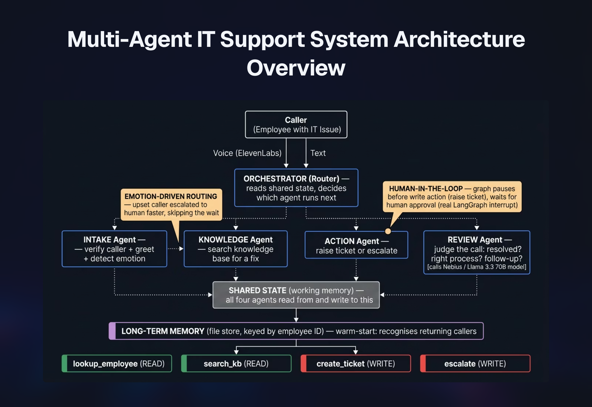

# Multi-Agent IT Support System (LangGraph)

A multi-agent IT support system built with LangGraph. It takes an employee IT
support request from start to finish: it greets and verifies the caller, finds a fix
from a knowledge base, raises a ticket or escalates to a human when it cannot resolve
the issue, and writes a structured review of the call afterwards.

This is the **multi-agent version** (Version 2) of the Week 3 project for the Mastering
Agentic AI course (The Gen Academy). The single voice-agent version (Version 1) is in
the repository root. All data is fake; there are no real company details.

---

## What makes this multi-agent

Instead of one general-purpose agent doing everything, this system uses **four
specialist agents** coordinated by an **orchestrator**:

| Agent | Job | Calls a model? |
|---|---|---|
| **Intake** | Greets the caller, verifies their identity, detects their emotional tone. | No — tools only |
| **Knowledge** | Searches the knowledge base for a fix. | No — tools only |
| **Action** | Raises a ticket (with human approval) or escalates to a human. | No — tools only |
| **Review** | Judges the call: was it resolved, was the right process followed, is follow-up needed. | Yes — Nebius/Llama |

The agents do not talk to each other directly. They all read from and write to one
shared **state** object that travels through the graph. The **orchestrator** is a routing
function that reads the state and decides which agent runs next. This is the routing
pattern: the right agent for each step, with the orchestrator coordinating.

---

## Architecture



---

## Key features

**Human-in-the-loop (HITL) approval before writes.** Before the system raises a ticket,
the graph pauses using LangGraph's real `interrupt()` and waits for a human to approve.
This is a genuine pause-and-resume, saved by a checkpointer — not a simple confirmation
prompt. Reads run on their own; writes need a human.

**Runaway-loop guardrail.** A maximum-steps cap stops the graph if it runs too long,
preventing the agent from looping forever.

**Long-term memory (warm-start).** The system remembers a caller across sessions. A
returning caller is recognised, and their past issues are recalled. Stored in a simple
file, keyed by employee ID. A production version would use a key-value store or a vector
database.

**Emotion-driven routing.** The system detects the caller's emotional tone from their
words. An upset or urgent caller is escalated to a human faster, instead of being made to
wait through more self-service steps. This is risk-tiered human-in-the-loop: the emotional
state changes the path, not just the wording.

**Proactive greeting.** If something is already known about the caller (an open ticket, a
recent notification), the system greets them by name and pre-empts their likely reason for
calling, instead of a generic "how can I help". It falls back to a normal greeting for
callers with no prior context.

---

## The voice front-end (ElevenLabs)

The system has two layers:

1. **The multi-agent brain (this folder):** the LangGraph system above, which can be run
   and tested as text.
2. **The voice front-end (ElevenLabs Conversational AI):** a voice agent that handles
   speech-to-text, the conversation, and text-to-speech, and calls the same backend tools
   over HTTP.

The voice agent calls the tool endpoints exposed by the FastAPI backend (in the repository
root, `main.py`). During development, the local backend is made reachable from ElevenLabs
using a tunnel (ngrok). The ElevenLabs agent itself is configured in the ElevenLabs
dashboard (system prompt plus four webhook tools pointing at the backend), so that
configuration lives there rather than in this repository.

The voice agent has been demonstrated end to end: it verifies a caller, searches the
knowledge base and reads back the fix, detects caller frustration, and escalates to a
human with a handoff identifier and a summary of what was tried.

One honest finding from testing: the voice responses are noticeably slow because all
agents use a large (70-billion-parameter) model. This is the latency trade-off in action.
A production voice agent would use a smaller, faster model for the conversational turns —
this is the planned next iteration and connects to the evaluation work in Week 5.

---

## The tools

The four agents use four tools (rebuilt here as LangChain tools, self-contained with stub
data):

| Tool | Type | What it does |
|---|---|---|
| `lookup_employee` | read (autonomous) | Verify the caller by employee ID. |
| `search_kb` | read (autonomous) | Find a fix in the knowledge base (keyword match, not a vector database — the knowledge base is small). |
| `create_ticket` | write (gated) | Raise a support ticket. Needs human approval first. |
| `escalate` | write (gated) | Hand off to a human, carrying a summary of what was tried. |

The tools return fake data from in-memory stubs. Swapping a stub for a real system (a real
employee directory, a real ticketing system) would not change the agent design — the tool
contract stays the same.

---

## Files in this folder

| File | What it is |
|---|---|
| `state.py` | The shared state object — the working/short-term memory all agents read and write. |
| `tools.py` | The four tools, as LangChain tools. |
| `agents.py` | The four agent functions. Only the Review agent calls the model. |
| `graph.py` | The LangGraph graph — wires the agents together, the orchestrator routing, the HITL interrupt, and the max-steps cap. |
| `memory.py` | The long-term memory layer (file store). |
| `requirements.txt` | The Python packages needed to run it. |

(`memory_store.json` is created at runtime and is not committed — it is fake caller data.)

---

## How to run it

You need Python 3 and a Nebius Token Factory API key (used by the Review agent).

```bash
# From inside the multiagent/ folder
python3 -m venv .venv
source .venv/bin/activate
pip install -r requirements.txt

# Create a .env file (not committed) with:
#   NEBIUS_API_KEY=your-key-here

# Run the graph
python graph.py
```

The `graph.py` file has a built-in demo that runs the system end to end and prints the
flow through all four agents, including the human-in-the-loop pause and the warm-start
memory.

---

## Design decisions

- **Read tools run on their own; write tools need a human.** The core safety rule.
- **A model is used only where judgement is needed.** Three agents just call tools; only
  the Review agent calls the model. This keeps cost and latency low.
- **The knowledge base is keyword matching, not a vector database.** Right-sized for a
  small knowledge base; a vector database would be extra weight for no gain.
- **Emotion changes routing, not just wording.** An upset caller is escalated faster.
- **A single agent (Version 1) and a multi-agent system (Version 2) were both built**, to
  show the judgement of when each pattern is appropriate.
- **Skills were considered but not used.** Each agent's behaviour fits in its prompt and
  tool descriptions, so a separate skill layer would add indirection without benefit.

---

## Where this goes next

- **Faster model for voice:** a smaller model for the conversational turns, to cut latency
  (the light/strong model split).
- **Observability and evaluation (→ Week 5):** tracing, a golden test set, model-as-judge.
- **Local or fine-tuned models (→ Week 4):** where a local model could replace a cloud call.
- **Security and production hardening (→ Week 6):** prompt-injection defence, authentication,
  audit trail, data-privacy controls, and gated handling of any high-risk actions.

---

*Part of the Mastering Agentic AI course (The Gen Academy), Week 3. Built in the open.
All data is fake; no real company details are included.*
